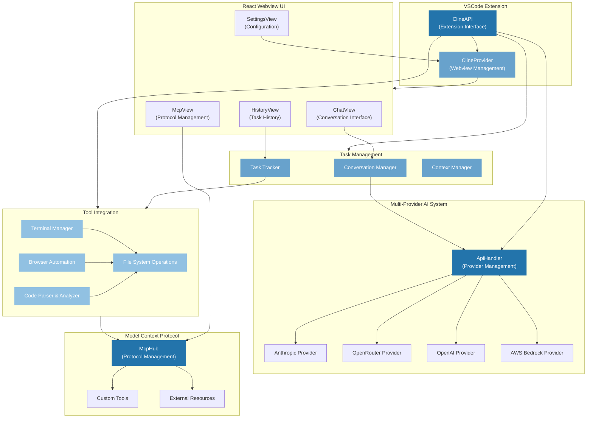

# Cline Architecture Diagram

This architecture diagram illustrates the core components and interactions of the Cline VSCode extension:

1. **VSCode Extension Layer**
   - ClineAPI: Primary interface for the VSCode extension
   - ClineProvider: Manages webview and extension state

2. **React Webview UI**
   - ChatView: Main conversation interface
   - SettingsView: Configuration management
   - HistoryView: Task history tracking
   - McpView: Protocol management interface

3. **Multi-Provider AI System**
   - ApiHandler: Manages multiple AI provider integrations
   - Supported providers: Anthropic, OpenRouter, OpenAI, AWS Bedrock

4. **Task Management System**
   - Conversation Manager: Handles AI interactions
   - Task Tracker: Manages task state and progress
   - Context Manager: Handles sliding window context

5. **Tool Integration System**
   - File System Operations: File management and modifications
   - Terminal Manager: Command execution and monitoring
   - Browser Session: Web automation and testing
   - Language Parser: Code analysis across languages

6. **Model Context Protocol (MCP)**
   - McpHub: Central protocol management
   - Custom Tools: Extensible tool system
   - External Resources: Resource management

The arrows indicate the flow of data and control between components, showing how the different systems interact to provide a cohesive development environment.
